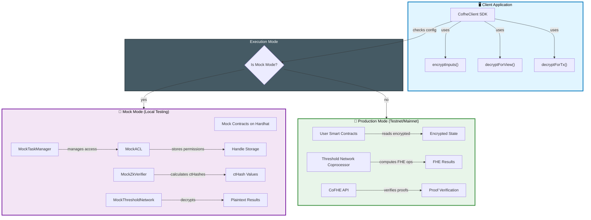
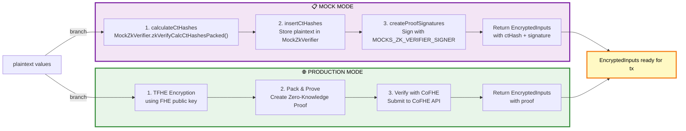
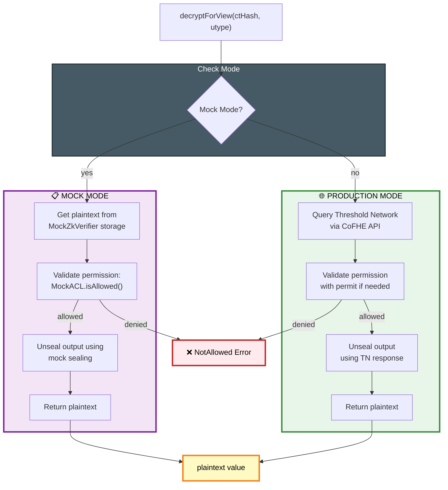
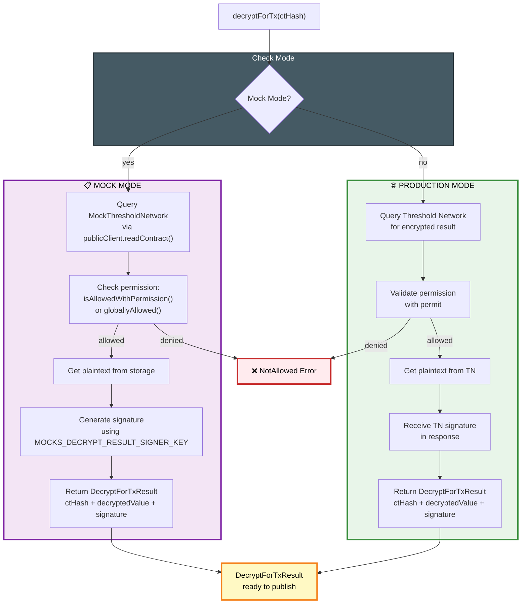
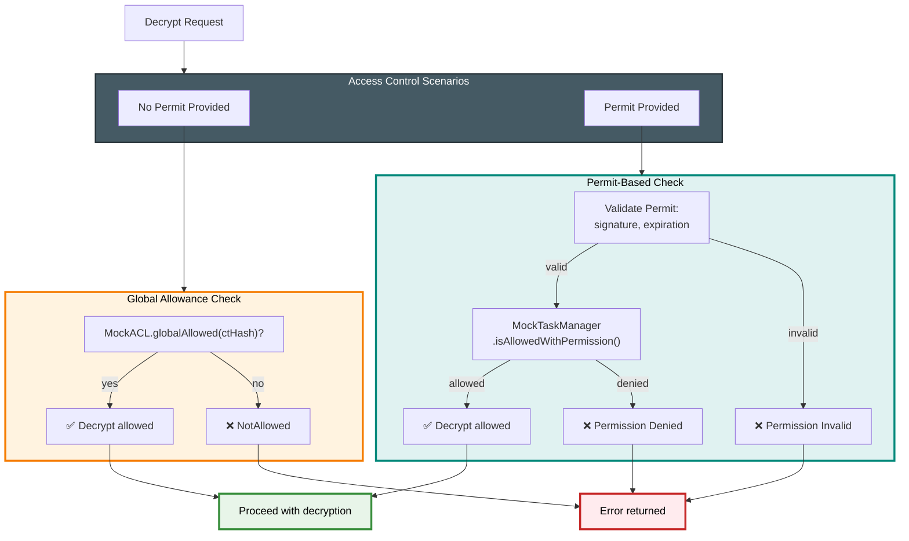
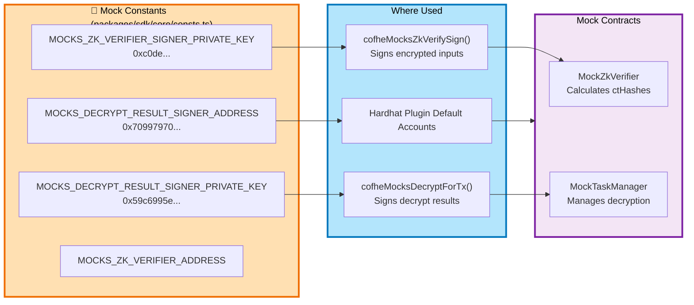
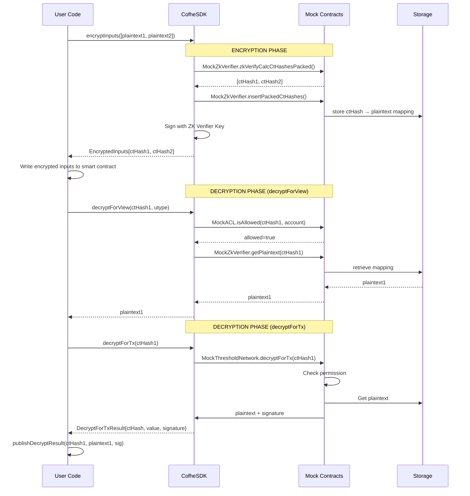

# CoFHE SDK Architecture: Mock vs Production Mode

This document explains how the CoFHE SDK components connect in both mock (local testing) and production modes.

## High-Level Overview



---

## Encryption Flow: Mock vs Production



---

## Decryption Flow: decryptForView (View Calls)



---

## Decryption Flow: decryptForTx (Transaction Submission)



---

## Permission Model: Access Control



---

## Mock Constants & Key Management



---

## Data Flow: From Encryption to Decryption



---

## Component Interaction Matrix

| Component | Mock Mode | Production Mode | Purpose |
|-----------|-----------|-----------------|---------|
| **EncryptInputs** | Uses MockZkVerifier to calculate ctHashes | Uses TFHE + ZK proofs | Generate encrypted inputs |
| **decryptForView** | Reads from MockZkVerifier storage + checks MockACL | Queries Threshold Network API | View calls (no proof needed) |
| **decryptForTx** | Calls MockThresholdNetwork with signature | Calls Threshold Network coprocessor | Transaction submission (with proof) |
| **Permits** | Stored in-memory + validated against MockACL | Stored on-chain + validated by TN | Access control mechanism |
| **Signatures** | Mock signer key (hardcoded for testing) | Real TN signer (from network) | Proof of decryption |
| **State Storage** | In-memory maps in mock contracts | On-chain encrypted state | Where encrypted values live |

---

## Key Insight: The Abstraction

The CoFHE SDK provides a **unified API** that works identically in both modes:

```typescript
// Same code works in both mock and production!
const encrypted = await client.encryptInputs([Encryptable.uint32(42)]).execute();
const plaintext = await client.decryptForView(encrypted[0].ctHash, FheTypes.Uint32).execute();
```

The difference is **implementation**:
- **Mock**: Direct function calls to in-memory contracts
- **Production**: RPC calls to network (Threshold Network, CoFHE API)

This allows developers to:
1. ✅ Test locally with mocks (fast, no network)
2. ✅ Deploy same code to production (testnet/mainnet)
3. ✅ Debug with complete visibility in mock mode
4. ✅ Trust that production will work the same way

---

## Files Reference

**Mock Implementations:**
- `packages/sdk/core/encrypt/cofheMocksZkVerifySign.ts` - Encryption in mock mode
- `packages/sdk/core/decrypt/cofheMocksDecryptForTx.ts` - decryptForTx in mock mode
- `packages/sdk/core/decrypt/cofheMocksDecryptForView.ts` - Decrypting in view calls (mock mode)
- `packages/mock-contracts/contracts/MockTaskManager.sol` - Main mock contract
- `packages/mock-contracts/contracts/MockACL.sol` - Permission management

**Client API:**
- `packages/sdk/core/client.ts` - CofheClient implementation
- `packages/sdk/core/decrypt/decryptForViewBuilder.ts` - decryptForView builder
- `packages/sdk/core/decrypt/decryptForTxBuilder.ts` - decryptForTx builder

**Tests:**
- `packages/hardhat-plugin-test/test/decryptForTx-builder.test.ts` - Builder tests
- `packages/hardhat-plugin-test/test/decryptForTx-publish.test.ts` - Publish flow test
