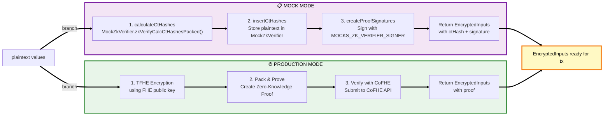
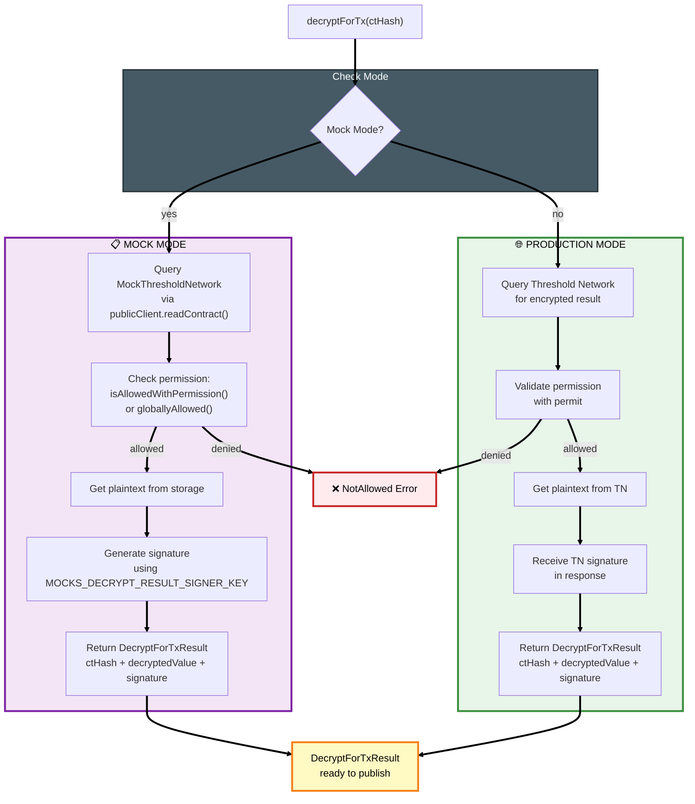
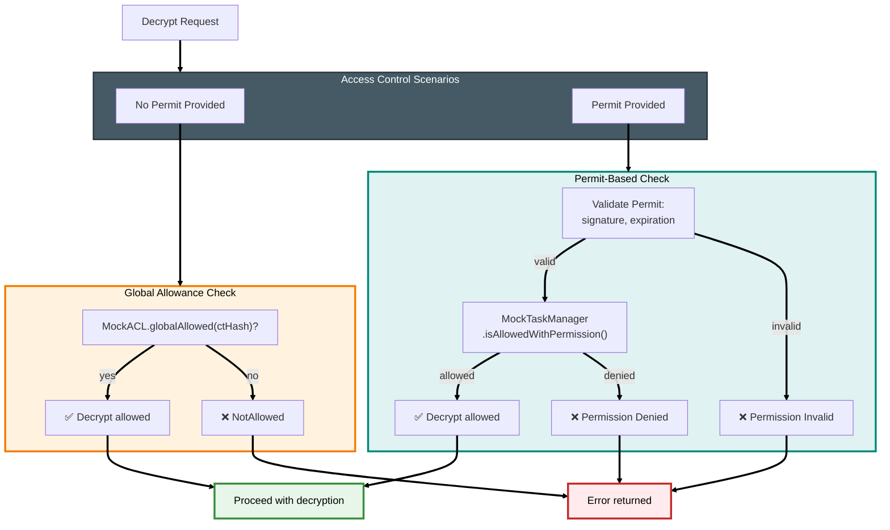
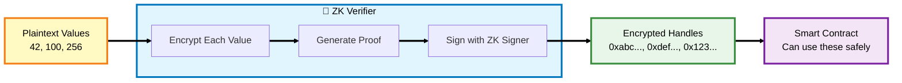
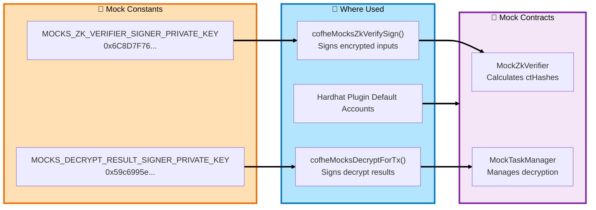
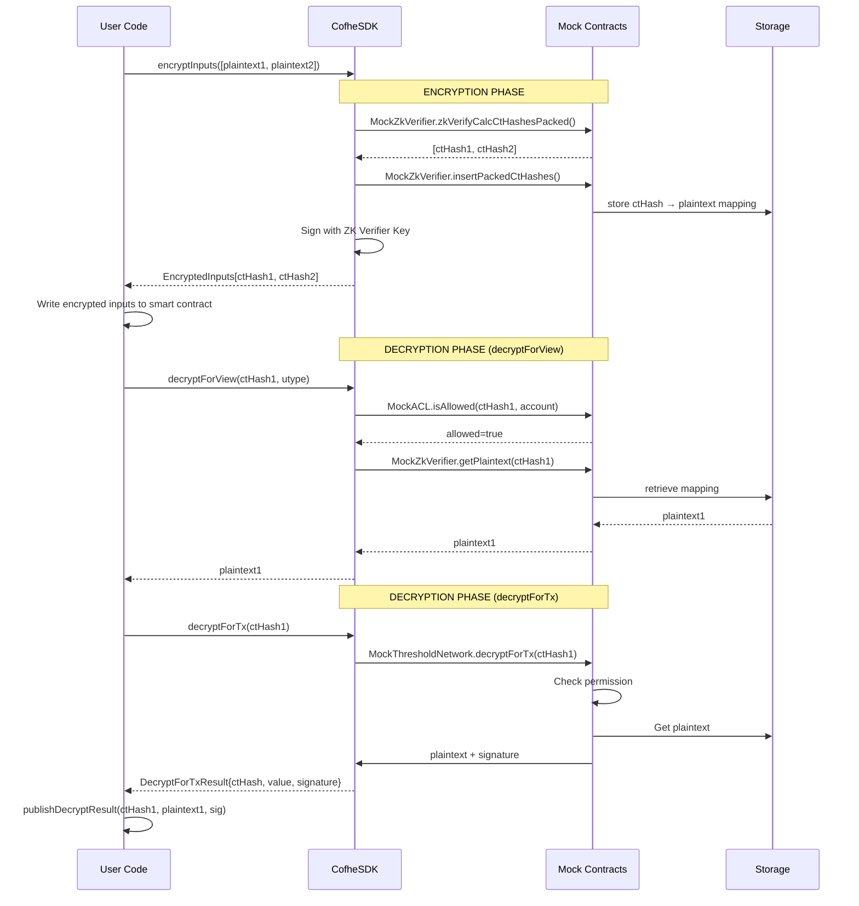

# CoFHE SDK Architecture: Mock vs Production Mode

This document explains how the CoFHE SDK components connect in both mock (local testing) and production modes.

## High-Level Overview


---

## Encryption Flow: Mock vs Production



---

## Decryption Flow: decryptForView (View Calls)


---

## Decryption Flow: decryptForTx (Transaction Submission)



---

## Permission Model: Access Control



---

## The Role of ZK Verifier

The **ZK Verifier** is responsible for the **encryption phase** - converting plaintext values into encrypted ciphertext handles (ctHashes) that can be used in smart contracts.

### Where It Lives (and What "Verifier" Means Here)

The SDK uses the term **"ZK Verifier"** for the component that ultimately produces **on-chain verifiable attestations** that an encrypted handle (ctHash) is *well-formed*.

- **Production (testnet/mainnet):** the verifier is an **off-chain verifier service** (configured via `supportedChains[].verifierUrl`).
    - The SDK calls `POST {verifierUrl}/verify` (see `zkPackProveVerify.ts`).
    - That service verifies the ZK proof and returns `(ct_hash, signature)` for each input.
- **Mock mode (Hardhat/local testing):** there is no real ZK proof verification.
    - `MockZkVerifier` (contract) exists only to deterministically derive ctHashes and store ctHash→plaintext mappings for mock FHE operations.
    - The SDK produces a **mock signature** using `MOCKS_ZK_VERIFIER_SIGNER_PRIVATE_KEY` so you can still exercise the "signed input" plumbing.

In other words: **in production, the verifier lives off-chain; on-chain contracts never call it directly.** Contracts only validate a signature that *originates* from the verifier.

### Why Smart Contracts Trust It

The protocol’s trust boundary here is not “an HTTP endpoint”, it’s **an authorization check enforced on-chain**: encrypted inputs are accepted only if they carry a signature that verifies against an **authorized verifier identity** configured in the CoFHE system contracts.

- The on-chain trust anchor is the **Task Manager** contract (the CoFHE system contract your app uses via `FHE.sol`).
- When a contract receives an `EncryptedInput` (ctHash + metadata + signature), the Task Manager verifies the signature and accepts the input only if it was signed by the configured **verifier signer**.
    - You can see the exact mechanism in the mocks: `MockTaskManager.verifyInput()` recovers the signer and compares it against `verifierSigner`.

Operationally, in production the verifier service/API returns signatures that are produced by the verifier’s authorized signing authority *after* the ZK proof checks pass. How that signing authority is implemented is intentionally an off-chain concern (it could be a single signer, an HSM-backed key, or a distributed/threshold signer), but the on-chain rule is stable: **only signatures from the authorized verifier identity are accepted**.

#### What The ZK Proof Checks (Conceptually)

At encryption time the SDK builds a **packed ciphertext list + proof** and sends it to the verifier along with explicit metadata:

- `packed_list`: the serialized ciphertext/proof blob
- `account_addr`, `security_zone`, `chain_id`: metadata that the SDK also bakes into the proof statement (see `constructZkPoKMetadata(...)`)

The verifier’s job is to validate that the submitted blob is a *valid proof* for the expected statement. While the exact circuit/statement is defined by the verifier implementation, the checks are conceptually in this class:

1. **Proof validity under the expected parameters**
    - The proof verifies against the expected CRS and the network’s public FHE key (fetched by the SDK).
2. **Well-formed encryption of the claimed inputs**
    - The prover demonstrates knowledge of plaintext(s) and encryption randomness such that the ciphertext list is a correct encryption of those plaintexts.
    - The packed representation is consistent (no malformed ciphertext encoding).
3. **Metadata binding (anti-replay / context binding)**
    - The proof is bound to `(account_addr, security_zone, chain_id)` so the resulting ciphertext handles cannot be reused out of context.
4. **Type/size constraints enforced by the SDK**
    - The SDK refuses to build proofs exceeding 2048 total bits (`MAX_ENCRYPTABLE_BITS`) and encodes values according to the selected `FheTypes.*`.
    - (Whether the verifier redundantly enforces these constraints is verifier-defined; the important part is: the proof corresponds to the packed encoding the SDK produced.)

If these checks pass, the verifier returns a **ctHash** (handle derived from the proven ciphertext) and a **signature** that attests: “this ctHash corresponds to a ciphertext proven valid under the expected metadata”. The signature is what the on-chain Task Manager ultimately authenticates.

The contract “trusts the verifier” in the same way it “trusts an oracle”: through governance/deployment configuration plus cryptographic authentication.

1. The contract already trusts the Task Manager system contract.
2. The Task Manager is configured (by the protocol / deployment owner) with the expected `verifierSigner` address.
3. A valid signature from that address is treated as an attestation: “this ctHash corresponds to a correctly generated ciphertext under the expected metadata (chain/security zone/account)”.

This turns “trust the verifier” into a standard on-chain pattern: **trust a key that can be rotated and governed**, rather than trusting an off-chain process directly.

### What It Does

**In Mock Mode (Local Testing):**

1. **Calculates ctHashes**: Takes plaintext values and generates deterministic ciphertext handles
2. **Stores Mappings**: Writes `ctHash → plaintext` into the mock on-chain storage (via `MockZkVerifier` → `MockTaskManager`) so mock FHE ops can “decrypt” later
3. **Signs Inputs**: Creates a signature using `MOCKS_ZK_VERIFIER_SIGNER_PRIVATE_KEY` to prove the encrypted inputs are valid

**In Production:**

1. **TFHE Encryption**: Performs actual Fully Homomorphic Encryption using the network's public key
2. **Zero-Knowledge Proofs**: Generates cryptographic proofs that the encryption was done correctly
3. **CoFHE Verification**: Submits proofs to the CoFHE verifier service/API (`supportedChains[].verifierUrl`) which verifies and returns signatures for on-chain validation

### Why It's Called "ZK Verifier"

The name comes from **Zero-Knowledge Proof Verification** - in production, this component verifies that:

- The encrypted data was created correctly
- The encryption matches the claimed plaintext structure
- No one can learn anything about the plaintext from the proof

In mock mode, we skip the heavy cryptographic operations but maintain the same API structure.

### Why It's Required: The Trust Problem

**Without ZK Verifier, there's no way to trust encrypted inputs:**

❌ **Attack Without ZK Verifier:**

```solidity
// Malicious user could submit fake encrypted data:
bytes32 fakeCtHash = 0xabcd1234...; // Just random bytes, not actual encryption
contract.storeValue(fakeCtHash);    // Contract accepts it blindly
// Later: Decryption fails or returns garbage
```

✅ **Protection With ZK Verifier:**

```solidity
// ZK Verifier ensures the ctHash is legitimate:
EncryptedInputs memory inputs = client.encryptInputs([42, 100]).execute();
// inputs.ctHashes[0] comes with a valid signature/proof
// CoFHE system contracts (Task Manager via FHE.sol) verify the signature on-chain
contract.storeValue(inputs.ctHashes[0], inputs.signatures[0]);
// If signature is invalid → the CoFHE verification step reverts
```

**The Core Security Guarantee:**

The ZK Verifier solves the **"Who encrypted this?"** problem:

1. 🔴 **Without it**: Anyone can create arbitrary ctHash values and claim they're encrypted
2. 🟢 **With it**: Only properly encrypted data (with valid signatures/proofs) is accepted

**In Production:** The ZK proof mathematically guarantees that:

- The ctHash was generated from actual encrypted data
- The encryption used the correct public key
- The data structure matches what the smart contract expects

**In Mock Mode:** The signature from `MOCKS_ZK_VERIFIER_SIGNER_PRIVATE_KEY` serves the same purpose:

- Only SDK-generated ctHashes have valid signatures
- Smart contracts (via the CoFHE Task Manager) can verify the signature before accepting encrypted inputs
- Tests can't accidentally use invalid/corrupted encrypted data

Note: in some mock/debug deployments the verifier signer may be intentionally unset (`verifierSigner == address(0)`), which disables signature checks.

### Key Insight

Think of ZK Verifier as the **"encryption gateway"**:

- **Before**: You have plaintext numbers (42, 100, 256)
- **After**: You have encrypted handles (ctHashes) that can be safely used in smart contracts
- **Guarantee**: The ZK proof ensures the encryption is valid without revealing the plaintext



**Related Components:**

- **MockZkVerifier** (contract): Stores the ctHash→plaintext mappings in mock mode
- **MOCKS_ZK_VERIFIER_SIGNER_PRIVATE_KEY** (constant): Used to sign encrypted inputs
- **cofheMocksZkVerifySign()** (function): SDK function that performs mock encryption

---

## Mock Constants & Key Management



---

## Data Flow: From Encryption to Decryption (Mock Mode)

**This sequence diagram shows the complete flow in mock/testing mode. In production, the steps are similar but use Threshold Network API instead of mock contracts.**



---

## Component Interaction Matrix

| Component          | Mock Mode                                                                                             | Production Mode                                                                 | Purpose                                                            |
| ------------------ | ----------------------------------------------------------------------------------------------------- | ------------------------------------------------------------------------------- | ------------------------------------------------------------------ |
| **EncryptInputs**  | Uses MockZkVerifier to calculate ctHashes                                                             | Uses TFHE + ZK proofs                                                           | Generate encrypted inputs                                          |
| **decryptForView** | Reads from MockZkVerifier storage + checks MockACL, returns sealed plaintext, unseals with permit key | Queries Threshold Network for sealed plaintext, unseals with permit sealing key | View calls (read & unseal plaintext, no proof)                     |
| **decryptForTx**   | Calls MockThresholdNetwork with permission check, gets plaintext + signature                          | Queries Threshold Network for plaintext + signature                             | Transaction submission (needs signature for on-chain verification) |
| **Permits**        | Stored in-memory + validated against MockACL                                                          | Stored on-chain + validated by TN                                               | Access control mechanism                                           |
| **Signatures**     | Mock signer key (hardcoded for testing)                                                               | Real TN signer (from network)                                                   | Proof of decryption                                                |
| **State Storage**  | In-memory maps in mock contracts                                                                      | On-chain encrypted state                                                        | Where encrypted values live                                        |

---

## Key Insight: The Abstraction

The CoFHE SDK provides a **unified API** that works identically in both modes:

```typescript
// Same code works in both mock and production!
const encrypted = await client.encryptInputs([Encryptable.uint32(42)]).execute();
const plaintext = await client.decryptForView(encrypted[0].ctHash, FheTypes.Uint32).execute();
```

The difference is **implementation**:

- **Mock**: Direct function calls to in-memory contracts
- **Production**: RPC calls to network (Threshold Network, CoFHE API)

This allows developers to:

1. ✅ Test locally with mocks (fast, no network)
2. ✅ Deploy same code to production (testnet/mainnet)
3. ✅ Debug with complete visibility in mock mode
4. ✅ Trust that production will work the same way

---

## Files Reference

**Mock Implementations:**

- `packages/sdk/core/encrypt/cofheMocksZkVerifySign.ts` - Encryption in mock mode
- `packages/sdk/core/decrypt/cofheMocksDecryptForTx.ts` - decryptForTx in mock mode
- `packages/sdk/core/decrypt/cofheMocksDecryptForView.ts` - Decrypting in view calls (mock mode)
- `packages/mock-contracts/contracts/MockTaskManager.sol` - Main mock contract
- `packages/mock-contracts/contracts/MockACL.sol` - Permission management

**Client API:**

- `packages/sdk/core/client.ts` - CofheClient implementation
- `packages/sdk/core/decrypt/decryptForViewBuilder.ts` - decryptForView builder
- `packages/sdk/core/decrypt/decryptForTxBuilder.ts` - decryptForTx builder

**Tests:**

- `packages/hardhat-plugin-test/test/decryptForTx-builder.test.ts` - Builder tests
- `packages/hardhat-plugin-test/test/decryptForTx-publish.test.ts` - Publish flow test
