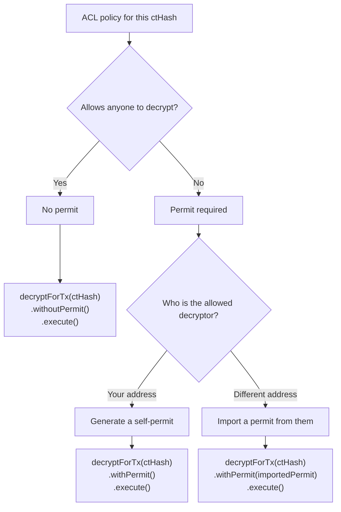

<a
   href="#"
   aria-label="Open decision guide in popup"
   style={{ display: 'block', textDecoration: 'none', cursor: 'pointer' }}
   onClick={(e) => {
      e.preventDefault();
      const dialog = document.getElementById('decision-guide-dialog');
      if (dialog instanceof HTMLDialogElement) dialog.showModal();
   }}
>
   

   

</a>

<dialog
   id="decision-guide-dialog"
   style={{
      width: 'min(1100px, 96vw)',
      maxHeight: '90vh',
      overflow: 'auto',
      padding: 16,
      textAlign: 'center',
   }}
   onClick={(e) => {
      const currentTarget = e.currentTarget;
      if (e.target === currentTarget && currentTarget instanceof HTMLDialogElement) {
         currentTarget.close();
      }
   }}
>
   

   

</dialog>

