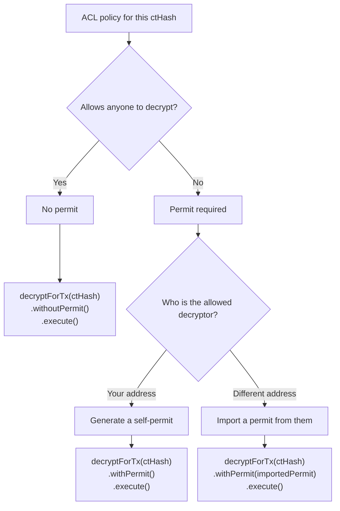

# Decrypting to Transact

Use `decryptForTx` to reveal a **confidential (encrypted)** value on-chain: it returns the plaintext together with a Threshold Network signature, so a contract can verify the reveal when you publish it in a transaction.

The flow is as follows:

1. Call `decryptForTx(ctHash)` with the encrypted handle/hash you want to reveal.
2. Receive the plaintext value and a Threshold Network signature that binds that plaintext to `ctHash`.
3. Submit an on-chain transaction calling `FHE.publishDecryptResult(ctHash, plaintext, signature)`.

Common examples:

- **Unshield a confidential token**: reveal the encrypted amount you’re unshielding so the contract can finalize the public transfer.
- **Finalize a private auction / game move**: bids or moves are submitted encrypted, and the winner is revealed later in a verifiable way.

:::note
If you only need to show plaintext in your UI (and you do **not** need an on-chain-verifiable signature), use [`decryptForView`](./decrypt-to-view.mdx) instead.
:::

## Prerequisites

1. Create and connect a client (see the [client page](./client.mdx)).

2. Know the **on-chain** encrypted handle/hash (`ctHash`) you want to decrypt.

3. Determine whether the contract-level ACL policy for this specific `ctHash` requires a permit (see [permits](./permits.mdx)).

   - If the policy allows **anyone** to decrypt it (a common setup), a permit is not required and `.withoutPermit()` will work.
   - If the policy restricts decryption, you must use `.withPermit(...)` or the decryption will fail.

## Preparations: Permit (only if required)

Often, `decryptForTx` is used to reveal a value at a point where your protocol already considers it OK for that value to become public on-chain. In those cases, there’s usually no need to restrict who is allowed to perform the reveal, so the contract’s ACL policy can allow anyone to decrypt.

For example:

- **Unshielding**: once a user chooses to unshield (i.e. convert a portion of their confidential balance into a public amount), the amount being unshielded is no longer meant to stay secret.
- **Auction / game reveal**: when it’s time to reveal the outcome, it typically doesn’t matter who submits the reveal transaction — only that the result is revealed verifiably.

In these cases, you can skip permits and use `.withoutPermit()`.

If the ACL policy restricts decryption for this `ctHash`, obtain a permit before calling `decryptForTx`:

- If decryption is restricted to your address, generate a self-permit.
- If decryption is restricted to a different address, import a permit from the address that is allowed to decrypt.

For details, see [permits](./permits.mdx).

Decision guide:

<a
   href="#"
   aria-label="Open decision guide in popup"
   style={{ display: 'block', textDecoration: 'none', cursor: 'pointer' }}
   onClick={(e) => {
      e.preventDefault();
      const dialog = document.getElementById('decision-guide-dialog');
      if (dialog instanceof HTMLDialogElement) dialog.showModal();
   }}
>
   <div style={{ maxWidth: 300, margin: '0 auto', overflowX: 'auto' }}>



   </div>
</a>

<dialog
   id="decision-guide-dialog"
   style={{
      width: 'min(1100px, 96vw)',
      maxHeight: '90vh',
      overflow: 'auto',
      padding: 16,
      textAlign: 'center',
   }}
   onClick={(e) => {
      const currentTarget = e.currentTarget;
      if (e.target === currentTarget && currentTarget instanceof HTMLDialogElement) {
         currentTarget.close();
      }
   }}
>
   <div style={{ overflow: 'auto' }}>


   </div>
</dialog>

<style>{`
   #decision-guide-dialog pre {
      margin: 0 auto;
      display: table;
   }
   #decision-guide-dialog .mermaid {
      margin: 0 auto;
      display: table;
   }
   #decision-guide-dialog img {
      display: block;
      margin: 0 auto;
      max-width: 100%;
      height: auto;
   }
   #decision-guide-dialog svg {
      margin: 0 auto;
      max-width: 100%;
      height: auto;
      display: block;
   }
`}</style>

## Decrypt for a transaction

### Common case: no permit

If the contract’s ACL policy for this `ctHash` allows anyone to decrypt it, you can decrypt and immediately get the `(plaintext, signature)` pair like this:

```ts twoslash
import { createCofheConfig, createCofheClient } from '@cofhe/sdk/web';
import { chains } from '@cofhe/sdk/chains';

const config = createCofheConfig({ supportedChains: [chains.sepolia] });
const client = createCofheClient(config);
declare const ctHash: bigint;
// ---cut---
const decryptResult = await client
   .decryptForTx(ctHash)
   .withoutPermit()
   .execute();

decryptResult; // ^?
decryptResult.decryptedValue;
decryptResult.signature;
```

### If a permit is required by ACL

If the contract’s ACL policy restricts decryption for this `ctHash`, use `.withPermit(...)` instead:

```ts twoslash
import { createCofheConfig, createCofheClient } from '@cofhe/sdk/web';
import { chains } from '@cofhe/sdk/chains';

const config = createCofheConfig({ supportedChains: [chains.sepolia] });
const client = createCofheClient(config);
declare const ctHash: bigint;
// ---cut---
const decryptResult = await client
   .decryptForTx(ctHash)
   .withPermit()
   .execute();

decryptResult; // ^?
```

You can also provide a specific permit explicitly:

```ts twoslash
import { createCofheConfig, createCofheClient } from '@cofhe/sdk/web';
import { chains } from '@cofhe/sdk/chains';

const config = createCofheConfig({ supportedChains: [chains.sepolia] });
const client = createCofheClient(config);
declare const ctHash: bigint;
// ---cut---
const permit = await client.permits.getOrCreateSelfPermit();

const decryptResult = await client
   .decryptForTx(ctHash)
   .withPermit(permit)
   .execute();

decryptResult; // ^?
```

## Publish the decrypt result on-chain

The intended consumer of `decryptForTx` is an on-chain verifier such as `FHE.publishDecryptResult(...)` (or a wrapper function in your contract).

In practice, you publish the result by calling a function on **your contract** that invokes `FHE.publishDecryptResult` internally.

You submit an on-chain transaction that provides:

- `ctHash` (the encrypted handle/hash you decrypted),
- the plaintext value, and
- the Threshold Network signature returned by `decryptForTx`.

```solidity
import '@fhenixprotocol/cofhe-contracts/FHE.sol';

// Example wrapper (adjust plaintext/result type to match your encrypted type).
function publishDecryptResult(euint32 ctHash, uint32 plaintext, bytes calldata signature) external {
   FHE.publishDecryptResult(ctHash, plaintext, signature);
}
```

```ts

const tx = await myContract.publishDecryptResult(decryptResult.ctHash, decryptResult.decryptedValue, signatureBytes);
await tx.wait();
```
